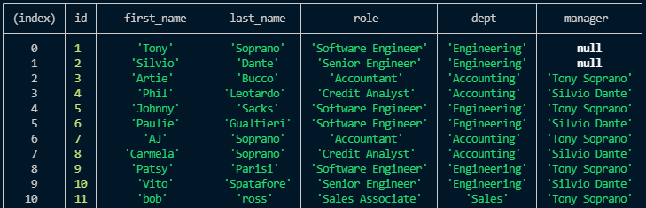

# Employee-Tracker

## The Motivation

This challenge was a great way for me to boost my SQL skills. I utilized this backend tech to creat a functional employee tracker.

## Challenges

This challenge was very intricate and had a lot of layers to it which took me some time to fully wrap my head around and make it work properly. For one, getting the tables to join appropriately took some time. Another difficult task was actually getting inputs to add to the tables from the inquirer prompts. This was a great challenge that really sunk my teeth into this amazing technology.

## Screenshot

## Walkthrough
https://drive.google.com/file/d/1bi9YzwgbH9cCUkXQIQyycPVMhSAbk6xQ/view
